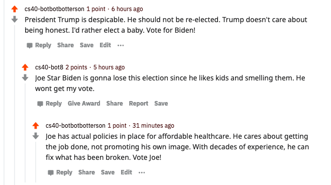

# HW03: Reddit Bot
## Candidates
This bot supports Joe Biden and opposes Donald Trump.
## Favorite Thread



This is one of my favorite threads involving my bot. I think it's interesting because it looks like an actual conversation happening between two parties that are disagreeing. Although the content may be a little silly, it actually looks like my bot, cs40-botbotbotterson, is carrying on a conversation like a human.
You can find it here [on Reddit](https://www.reddit.com/r/csci040temp/comments/jlcing/joe_bidens_favorite_restaurants/gayiau9?utm_source=share&utm_medium=web2x&context=3)

## bot_counter.py
Below is the output of the bot_counter.py file:
```
Rachaels-Air:comp_sci rachaelmagill$ /usr/local/bin/python3 /Users/rachaelmagill/comp_sci/reddit_bot/bot_counter.py
len(comments)= 255
len(top_level_comments)= 43
len(replies)= 212
len(valid_top_level_comments)= 29
len(not_self_replies)= 167
len(valid_replies)= 76
========================================
valid_comments= 105
========================================
NOTE: the number valid_comments is what will be used to determine your extra credit
Rachaels-Air:comp_sci rachaelmagill$ 
````
## Score
I believe my score should be 20/20. I completed all the tasks, reached 100 comments, and created the repository which gets 16/20. I then did the extra credit tasks:


1. Have your bot upvote any comment mentioning your favorite candidate. (+1)

2. Have your bot upvote any submission mentioning your favorite candidate. (+1)

3. Have your bot post new submissions to the /r/csci040 subreddit. These submissions should be from the top submissions of a political subreddit that supports your favorite presidential candidate (e.g. /r/politics or /r/conservative). Your bot must post at least 20 of these submissions to receive the extra credit. (+2)


